Java를 이용한 cmd 앱스토어
---
이 프로젝트는 콘솔 기반 앱스토어 시뮬레이션입니다.
관리자 계정을 통해 앱 추가, 수정 가능
사용자환경에서 파일에 저장되어있는 앱정보를 받아오고 설치하는 기능 시뮬레이션

  <table>
    <tr>
        <td colspan ='3'>UserPage</td>
    <tr>
        <td>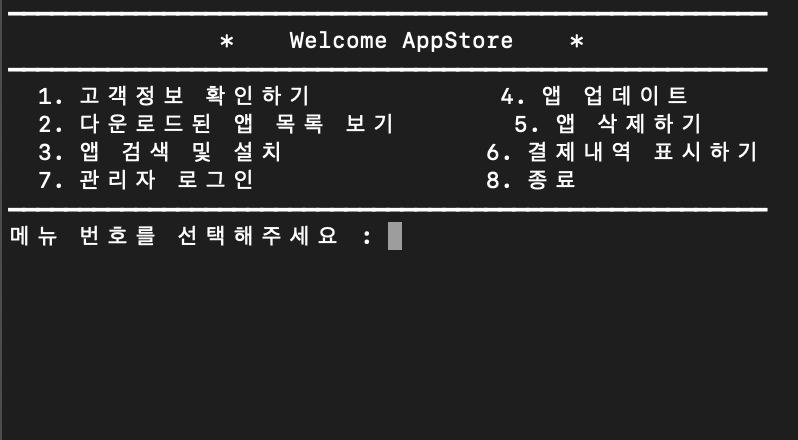</td>
        <td>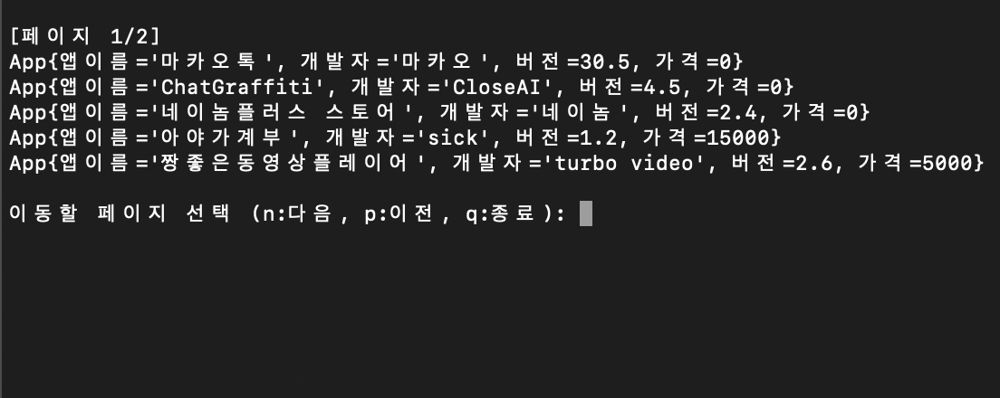</td>
        <td>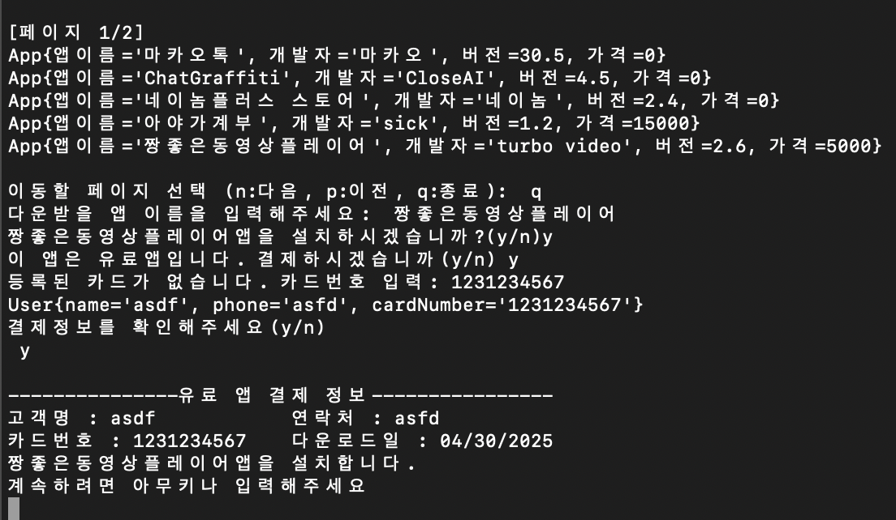</td>
    </tr>
    <tr>
        <td>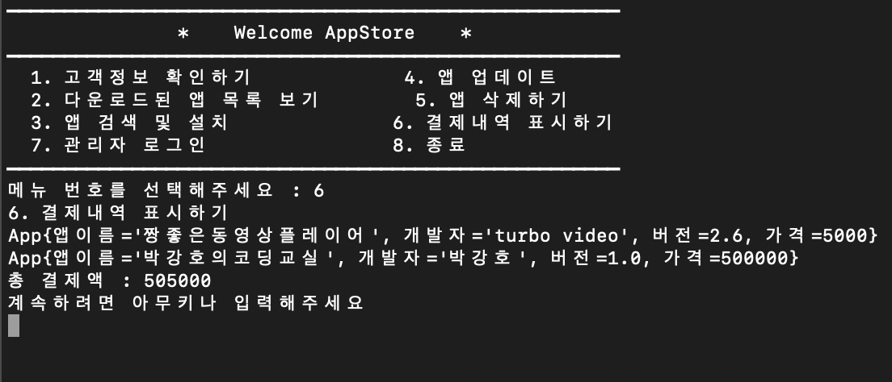</td>
        <td>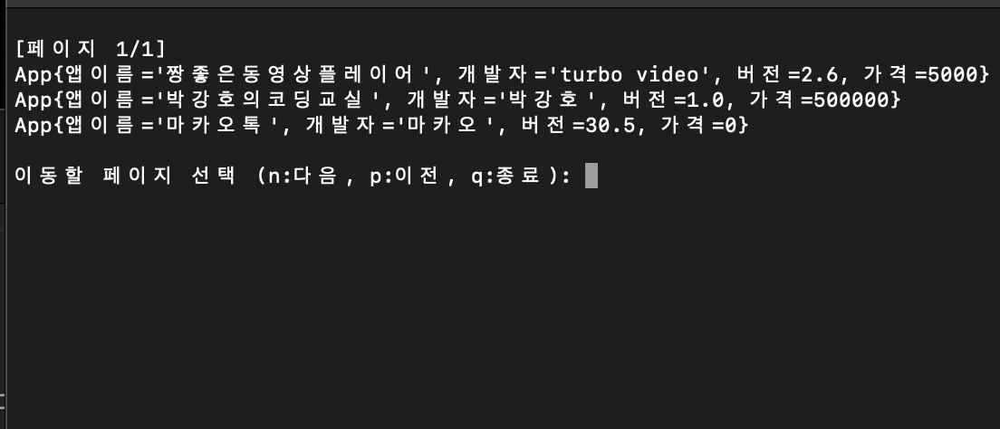</td>
    </tr>
  </table>

  <table>
    <tr>
        <td colspan ='3'>AdminPage</td>
    <tr>
        <td>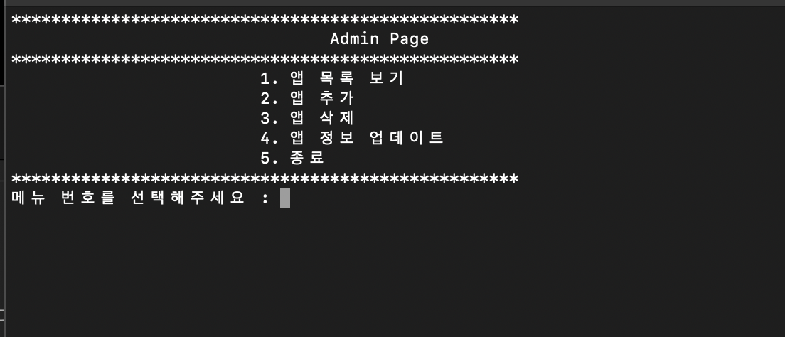</td>
        <td>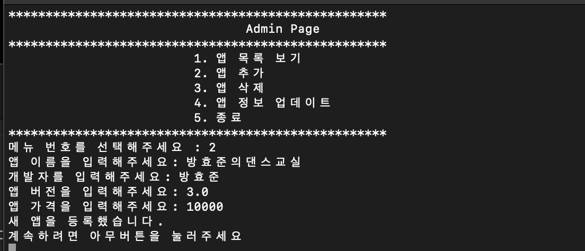</td>
        <td>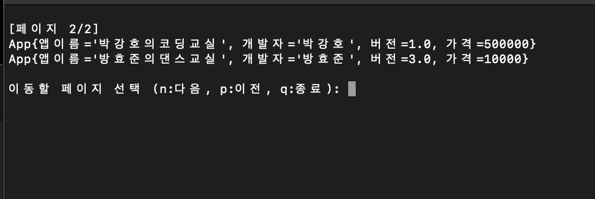</td>
    </tr>
  </table>

### todo
터미널 기준 정렬
=======

## 🖥️ 프로젝트 소개
cmd환경에서 앱스토어의 로직을 구현해본 프로젝트
관리자 계정을 통해 앱 추가, 수정 가능
사용자환경에서 파일에 저장되어있는 앱정보를 받아오고 설치하는 기능 시뮬레이션

## 🕰️ 개발 기간
* 2025.04.27~2025.04.28

### ⚙️ 개발 환경
- 운영체제: MacOS Sequoia
- 개발 도구: InteliJ 2023.3.8
- JDK 버전: OpenJDK 18.0.0.1
- 프로그래밍 언어: Java 18

## 📌 주요 기능
#### 관리자 모드

<table style = "text-align: center;">
    <tr>
        <td colspan="2"> 앱 추가 </td>
    </tr>
    <tr>
        <td></td>
        <td></td>
    </tr>
</table>

앱정보를 입력하여 파일에 저장하고 목록확인 가능

<table style = "text-align: center;">
    <tr>
        <td colspan="3"> 앱 삭제 </td>
    </tr>
    <tr>
        <td>삭제 전</td>
        <td>삭제</td>
        <td>삭제 후</td>
    </tr>
    <tr>
        <td>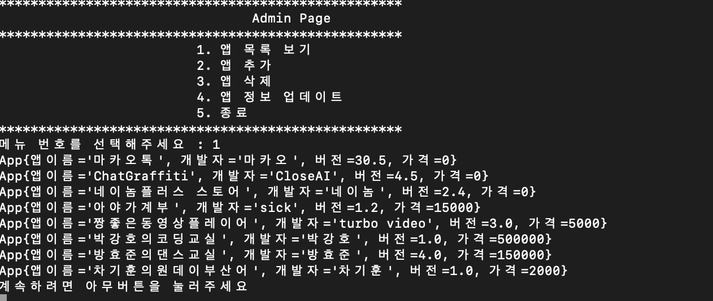</td>
        <td></td>
        <td>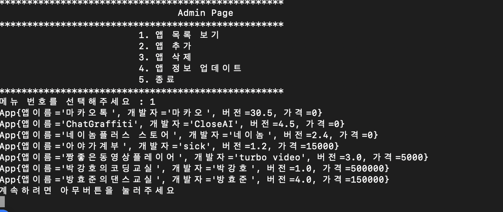</td>
    </tr>
</table>

등록된 앱이름을 입력하여 등록한 앱을 파일에서 삭제

<table style = "text-align: center;">
    <tr>
        <td colspan="2"> 앱 업데이트 </td>
    </tr>
    <tr>
        <td>업데이트</td>
        <td>업데이트 완료</td>
    </tr>
    <tr>
        <td>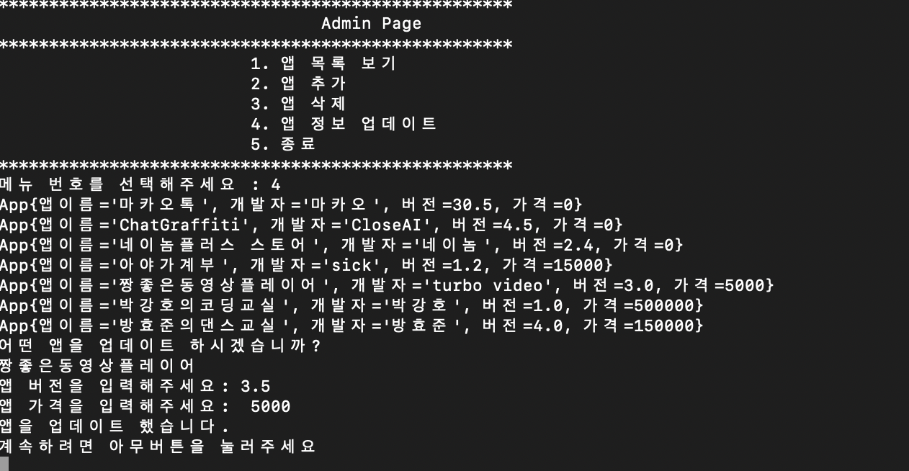</td>
        <td>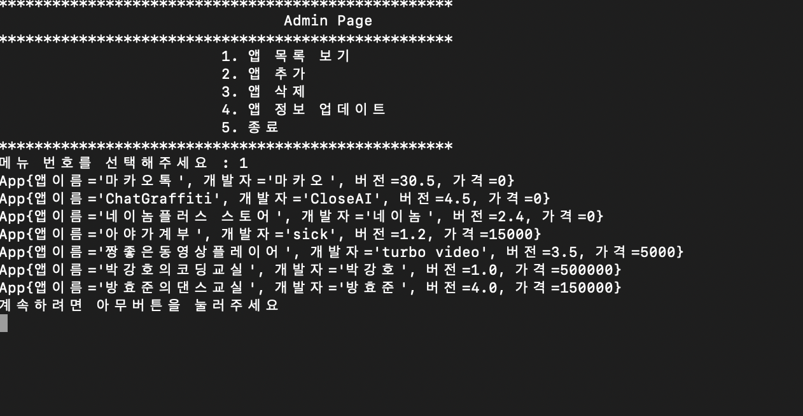</td>
    </tr>
</table>

#### 사용자 모드

<table style = "text-align: center;">
    <tr>
        <td colspan="2"> 앱 다운로드 </td>
    </tr>
    <tr>
        <td>무료 앱</td>
        <td>유료 앱</td>
    </tr>
    <tr>
        <td>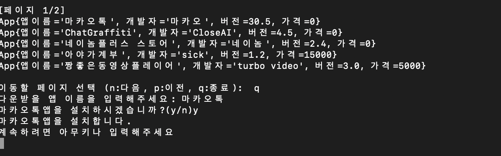</td>
        <td>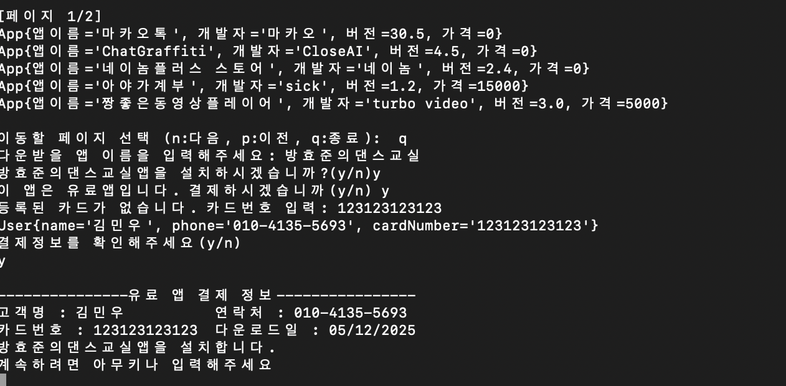</td>
    </tr>
</table>

목록확인 후 원하는 앱의 이름 입력하여 다운로드

<table style = "text-align: center; display:block; width:50%; margin:0 auto">
    <tr>
    <td> 다운로드된 앱 확인 </td>
    </tr>
    <tr>
        <td></td>
    </tr>
</table>

다운로드 된 앱들의 목록 확인

<table style = "text-align: center;">
    <tr>
        <td colspan="3"> 앱 삭제 </td>
    </tr>
    <tr>
        <td>삭제 전</td>
        <td>삭제</td>
        <td>삭제 후</td>
    </tr>
    <tr>
        <td></td>
        <td>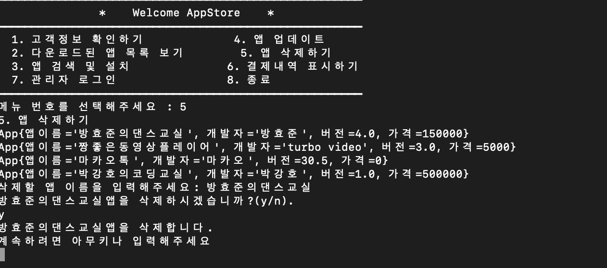</td>
        <td>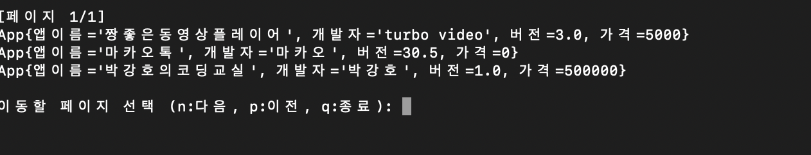</td>
    </tr>
</table>

다운받은 목록중 원하는 앱을 선택하여 삭제

<table style = "text-align: center; display:block; width:50%; margin:0 auto">
    <tr>
    <td> 결제내역 확인 </td>
    </tr>
    <tr>
        <td></td>
    </tr>
</table>

결제 완료한 내역에 대해 영수증 출력

